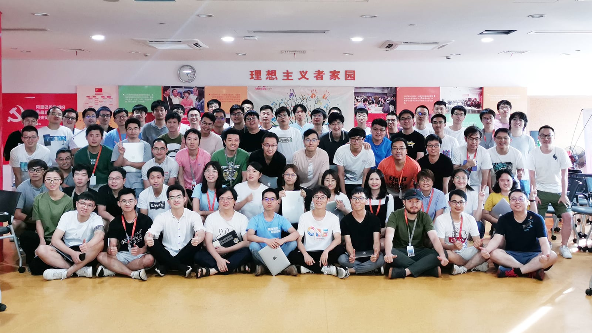

# CBU体验技术

## CBU体验技术 - 前端开发者月刊

* [2019-10-22](./monthly/2019-10-22.md) 创刊号

## CBU体验技术部

CBU体验技术部是阿里巴巴的前端团队，是一支高效、开放、有战斗力的团队, 团队内技术牛人云集，鼓励技术交流与分享，并有持续稳定的前端分享活动，在集团和B类事业群具有广泛的影响力，其中设计协同产品 Fusion Design 、 前端工程产品 Just、可视化构建系统 OCMS 在集团有广泛用户，技术上处于领先地位。除此之外，还有中后台产品 Seek、UI Builder 库 Hive、表单库 AForm 在业界有一定影响力。

